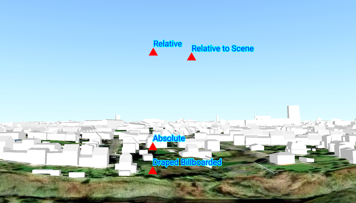

# Set surface placement mode

Position graphics relative to a surface using different surface placement modes.

## Use case

Depending on the use case, data might be displayed at an absolute height (e.g. flight data recorded with altitude information), at a relative height to the terrain (e.g. transmission lines positioned relative to the ground), at a relative height to objects in the scene (e.g. extruded polygons, integrated mesh scene layer), or draped directly onto the terrain (e.g. location markers, area boundaries).

## How to use the sample

TThe sample loads a scene showing four points that use the individual surface placement rules (absolute, relative, relative to scene, and either draped billboarded or draped flat). Use the toggle to change the draped mode and the slider to dynamically adjust the z value of the graphics. Explore the scene by zooming in/out and by panning around to observe the effects of the surface placement rules.

## How it works

1. Create a `GraphicsOverlay` for each `SurfacePlacement`:
   * `Absolute` positions the graphic using only its z-value.
   * `DrapedBillboarded` positions the graphic upright on the surface, always facing the camera, ignoring its z-value.
   * `DrapedFlat` positions the graphic flat on the surface, ignoring its z-value.
   * `Relative` positions the graphic using its z-value plus the elevation of the surface.
   * `RelativeToScene` positions the graphic using its z-value plus the altitude values of the scene.
2. Create and add graphics to the graphics overlays.
3. Set `GraphicsOverlay.sceneProperties.surfacePlacement` to the respective `SurfacePlacement`.
4. Create a `SceneView` instance with a scene and the graphics overlays.

## Relevant API

* Graphic 
* GraphicsOverlay
* GeometryEngine.createWithZ
* LayerSceneProperties
* Surface
* SurfacePlacement

## About the data

The scene shows a view of Brest, France. Four points are shown hovering with positions defined by each of the different surface placement modes (absolute, relative, relative to scene, and either draped billboarded or draped flat).

## Additional information

This sample uses an elevation service to add elevation/terrain to the scene. Graphics are positioned relative to that surface for the drapedBillboarded, drapedFlat, and relative surface placement modes. It also uses a scene layer containing 3D models of buildings. Graphics are positioned relative to that scene layer for the relativeToScene surface placement mode.

## Tags

3D, absolute, altitude, draped, elevation, floating, relative, scenes, sea level, surface placement
