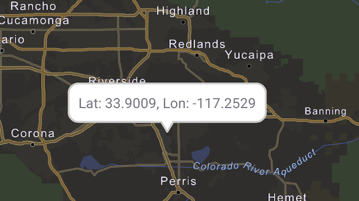

# Show callout

Show a callout with the latitude and longitude of user-tapped points.

## Use case

Callouts are used to display temporary detail content on a map. You can display text and arbitrary UI controls in callouts.

## How to use the sample

Tap anywhere on the map. A callout showing the WGS84 coordinates for the tapped point will appear.

## How it works

1. When the user taps, get the tapped location(map point) from the `SingleTapConfirmedEvent`.
2. Project the point's geometry to WGS84 using `GeometryEngine.projectOrNull(mapPoint, SpatialReference.wgs84())`.
3. To the composable `MapView`'s content, add a composable `Callout` passing it the location `Point` and calloutContent string.
4. Changes to the `latLongPoint` variable will trigger recomposition of the `Callout`.

## Relevant API

* Callout
* GeometryEngine
* MapView
* Point

## Additional information

This sample uses the GeoView-Compose Toolkit module to implement a Composable MapView, which supports the use of [Callouts](https://github.com/Esri/arcgis-maps-sdk-kotlin-toolkit/tree/v.next/toolkit/geoview-compose#display-a-callout).

## Tags

balloon, bubble, callout, flyout, flyover, **geoview-compose,** info window, popup, tap, toolkit
