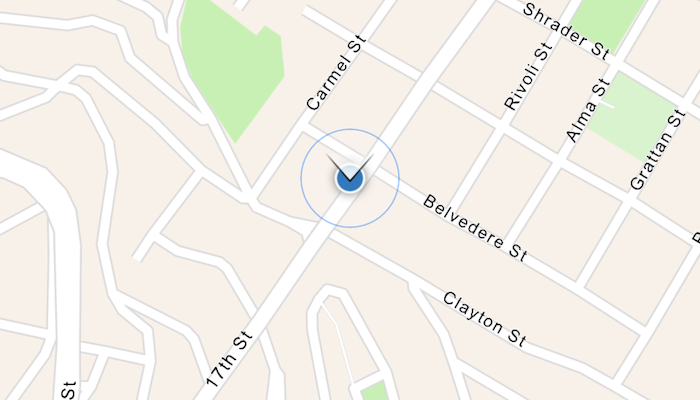

# Show device location using fused location data source

This sample demonstrates how to use the Fused Location Provider and Fused Orientation Provider to implement an ArcGIS Maps SDK Custom Location Data Source Location Provider.

## Use case

The [Fused Location Provider](https://developers.google.com/location-context/fused-location-provider) can provide more accurate location information than a single location provider. It uses GPS, Wi-Fi, and cell network data to determine the device's location. In urban areas, it can also use 3D building data in urban areas to improve GPS accuracy. Similarly, the [Fused Orientation Provider](https://android-developers.googleblog.com/2024/03/introducing-fused-orientation-provider-api.html) uses a fusion of magnetometer, accelerometer, and gyroscope data to provide a more accurate device orientation.

## How to use the sample

Start the sample and allow the app to access your device's location. The sample will display your location on the map. Use the priority and interval settings to change the location provider's behavior. Note the change in the location display when changing these settings--namely the change in the rate at which the expanding blue ring animation triggers (which signifies an updated location).

## How it works

1. Implement the `CustomLocationDataSource.LocationProvider` interface overriding the `headings` and `locations` flows.
2. Create a `FusedLocationProviderClient` and `FusedOrientationProviderClient` to get the device's location and orientation.
3. Request location and orientation updates from the clients, then emit these values into the `locations` and `headings` flows. Utilize the function `createArcGISLocationFromFusedLocation(...)` to convert a fused `Location` object into an `ArcGISLocation` object.
4. Create a `LocationDisplay` with `rememberLocationDisplay()` and set it to the composable `MapView`.
5. Set the `LocationDisplay` data source to a `CustomLocationDataSource` which implements the `LocationProvider` interface.

## Relevant API

* CustomLocationDataSource
* Location
* LocationDataSource
* LocationDisplay
* LocationProvider

## Additional information

The fused location and orientation APIs are part of Google Play Services. The fused location provider intelligently combines different signals, such as GPS and Wi-Fi, to provide location information. The fused orientation provider is a new API that allows users to access orientation information on Android devices.

## Tags

cell, fused, GPS, headings, locations, orientation, Wifi
