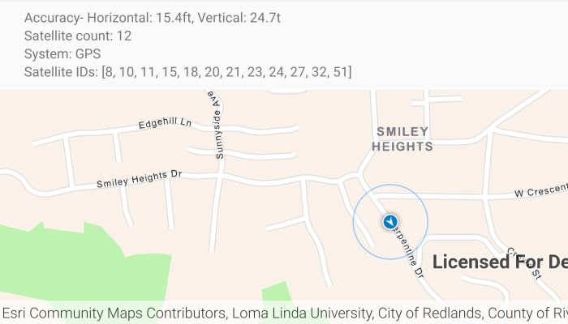

# Show device location with NMEA data sources

Parse NMEA sentences and use the results to show device location on the map.

## Use case

NMEA sentences can be retrieved from an MFi GNSS/GPS accessory and parsed into a series of coordinates with additional information.

The NMEA location data source allows for detailed interrogation of the information coming from a GNSS accessory. For example, allowing you to report the number of satellites in view, accuracy of the location, etc.

## How to use the sample

Click floating button "Play" to parse the provided NMEA sentences into a location data source, and display the location position and related satellite information. Click "Stop" to stop displaying the location information. The sample will automatically re-center the location data source as it moves across the map.

## How it works

1. Load NMEA sentences from a local file.
2. Parse the NMEA sentence strings, and push data into `NmeaLocationDataSource`.
3. Set the `NmeaLocationDataSource` to the `LocationDisplay`'s data source.
4. Start the location display to begin receiving location and satellite updates.

## Relevant API

* Location
* LocationDisplay
* NmeaLocationDataSource
* NmeaSatelliteInfo

## About the data

This sample reads lines from a local file to simulate the feed of data into the `NmeaLocationDataSource`. This simulated data source provides NMEA data periodically and allows the sample to be used without a GNSS accessory.

The route taken in this sample features a [2-minute driving trip around Redlands, CA](https://arcgis.com/home/item.html?id=d5bad9f4fee9483791e405880fb466da).

## Additional information

Please refer to the [ArcGIS Field Maps documentation](https://doc.arcgis.com/en/field-maps/latest/prepare-maps/high-accuracy-data-collection.htm) for model and firmware requirements.

## Tags

accessory, Bluetooth, GNSS, GPS, history, navigation, NMEA, real-time, trace
