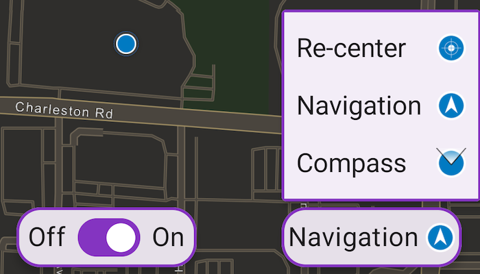

# Show device location

Show your current position on the map, as well as switch between different types of auto pan modes.

## Use case

When using a map within a GIS, it may be helpful for a user to know their own location within a map, whether that's to aid the user's navigation or to provide an easy means of identifying/collecting geospatial information at their location.

## How to use the sample

Tap the button in the lower right (which starts in On mode). A menu will appear with the following options:

* Off - Stops the location display.
* On - Starts the location display with `LocationDisplayAutoPanMode` set to `Off`.
* Re-Center - Starts the location display with `LocationDisplayAutoPanMode` set to `Recenter`.
* Navigation - Starts the location display with `LocationDisplayAutoPanMode` set to `Navigation`.
* Compass - Starts the location display with `LocationDisplayAutoPanMode` set to `CompassNavigation`.

## How it works

1. Create a `MapView`.
2. Get the `LocationDisplay` object by calling `rememberLocationDisplay()` on the map view.
3. Use `start()` and `stop()` on the `LocationDisplay.dataSource` as necessary.

## Relevant API

* ArcGISMap
* LocationDisplay
* LocationDisplay.AutoPanMode
* MapView

## Additional information

Location permissions are required for this sample.

This sample demonstrates the following `AutoPanMode` options:

* Recenter: In this mode, the MapView attempts to keep the location symbol on-screen by re-centering the location symbol when the symbol moves outside a "wander extent". The location symbol may move freely within the wander extent, but as soon as the symbol exits the wander extent, the MapView re-centers the map on the symbol.

* Navigation: This mode is best suited for in-vehicle navigation.

* CompassNavigation: This mode is better suited for waypoint navigation when the user is walking.

This sample uses the GeoView-Compose Toolkit module to be able to implement a composable MapView.

## Tags

GPS, compass, geoview-compose, location, map, mobile, navigation, toolkit
