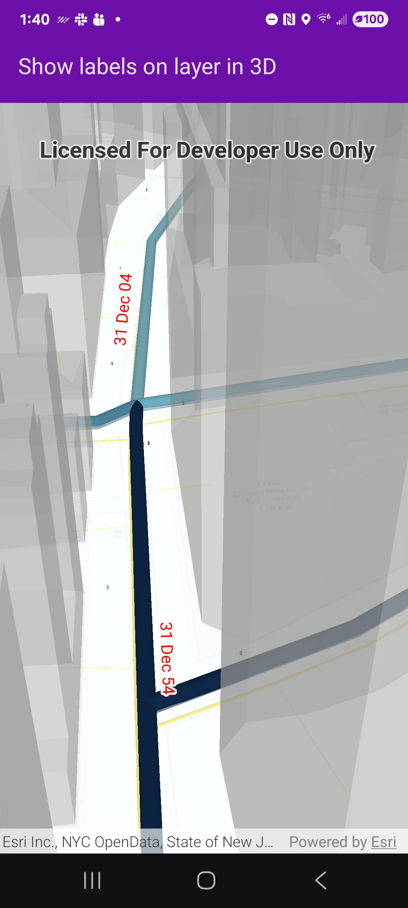

# Show labels on layer in 3D

Display custom labels in a 3D scene.

## Use case

Labeling features is useful to visually display a key piece of information or attribute of a feature on a map. For example, you may want to label rivers or streets with their names.

## How to use the sample

Pan and zoom to explore the scene. Notice the labels showing installation dates of features in the 3D gas network.

## How it works

1. Create an `ArcGISScene` from a `PortalItem`.
2. Add the scene to an `SceneView`and load it.
3. After loading is complete, obtain the `FeatureLayer` from one of the `GroupLayers` in the scene's operationalLayers.
4. Set the feature layer's `labelsEnabled` property to `true`.
5. Create an `TextSymbol` to use for displaying the label text.
6. Create an `LabelDefinition` using an `ArcadeLabelExpression`.
7. Add the definition to the feature layer's `labelDefinitions` array.

## Relevant API

* ArcadeLabelExpression
* FeatureLayer
* LabelDefinition
* Scene
* SceneView
* TextSymbol

## About the data

This sample shows a [New York City infrastructure](https://www.arcgis.com/home/item.html?id=850dfee7d30f4d9da0ebca34a533c169#overview) scene hosted on ArcGIS Online.

## Additional information

Help regarding the Arcade label expression script for defining a label definition can be found on the [ArcGIS Developers](https://developers.arcgis.com/arcade/) site.

## Tags

3D, arcade, attribute, buildings, label, model, scene, symbol, text, URL, visualization
