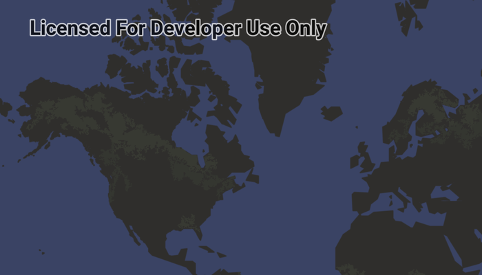

# Show line of sight analysis in map

Perform a line of sight analysis in a map view between fixed observer and target positions.

## Use case

Line of sight analysis determines whether a target can be seen from one or more observer locations based on elevation data. This can support planning workflows such as siting communication equipment, assessing observation coverage, or evaluating potential obstructions between known locations. In this sample, several predefined observer points are evaluated against a single fixed target to compare visibility outcomes side by side.

Note: This analysis is a form of "data-driven analysis", which means the analysis is calculated at the resolution of the data rather than the resolution of the display.

## How to use the sample

The sample loads with a map centered on the Isle of Arran, Scotland, and runs a line of sight analysis from multiple observer points (triangles) to a fixed target point (beacon icon) located at the highest point of the island. Solid green line segments represent visible portions of each line of sight result, and dashed gray segments represent not visible portions. The information panel summarizes each observer result and reports whether the target is visible and over what distance the line remains unobstructed. Use the checkbox in the panel to show only results where the target is visible from the observer.

## How it works

1. Create an `ArcGISMap` and set it on a `MapView` composable.
2. Create a `GraphicsOverlay` and add target and observer points to it, along with an appropriate symbol. Create another `GraphicsOverlay` that will display line of sight result graphics.
3. Create a `ContinuousField` from a raster file containing elevation data.
4. Create a list of `LineOfSightPosition` from target and observer `Point`s and a `HeightOrigin.Relative`.
5. Configure `LineOfSightParameters` with `ObserverTargetPairs` (many observers to the single target).
6. Create a `LineOfSightFunction` from the continuous field and parameters.
7. Evaluate the function to get `LineOfSight` results.
8. Check for any `LineOfSight.error` values.
9. Create a `Graphic` from each result, using the geometry of the result's `visibleLine` and `notVisibleLine`, and an appropriate symbol.
10. Use `LineOfSight.targetVisibility` to determine if the observer position has a direct line of sight to the target position.
11. Get the length of the visible line result with `GeometryEngine.lengthGeodetic` to report results.

## Download resources

This sample requires a local elevation raster to run the analysis. Provision the file to your device/emulator before launching the sample:

- Data item: Isle of Arran 10m Digital Terrain Model (DTM)
- Portal item ID: `aa97788593e34a32bcaae33947fdc271`
- Item URL: https://www.arcgis.com/home/item.html?id=aa97788593e34a32bcaae33947fdc271

Steps to provision the data:

1. Download the TIFF raster from the portal item above.
2. Rename the file to `arran.tif` (if necessary).
3. Copy `arran.tif` to your app's external files directory on the device or emulator:
   - Device path: `/Android/data/<your.application.id>/files/arran.tif`
   - Example (Sample Viewer): `/Android/data/com.esri.arcgismaps.sample.showlineofsightanalysisinmap/files/arran.tif`

Notes:
- On Android 11+ you may need to use Android Studio's Device File Explorer or ADB to place the file in the app-specific external directory.
- The sample looks for `arran.tif` in the external files directory at runtime. If the file is not found, the app shows guidance to provision the file.

## Relevant API

- ContinuousField
- LineOfSight
- LineOfSightFunction
- LineOfSightParameters
- LineOfSightPosition
- ObserverTargetPairs
- GeometryEngine
- GraphicsOverlay

## About the data

The sample uses a 10 m resolution digital terrain elevation raster of the Isle of Arran, Scotland. Raster data Copyright Scottish Government and SEPA (2014).

Portal item: https://www.arcgis.com/home/item.html?id=aa97788593e34a32bcaae33947fdc271

## Tags

analysis, elevation, line of sight, map view, spatial analysis, terrain, visibility