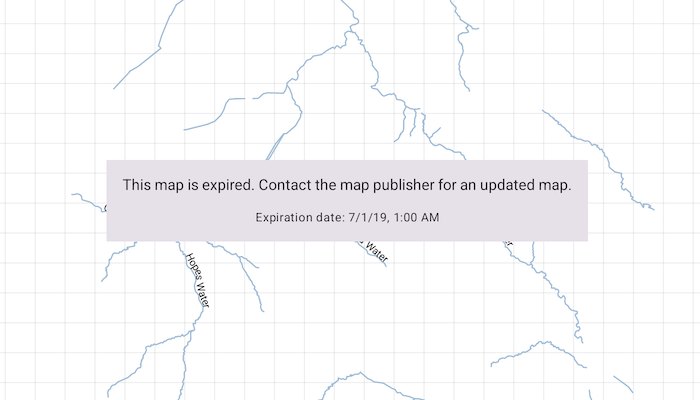

# Show mobile map package expiration date

Access the expiration information of an expired mobile map package.

## Use case

The data contained within a mobile map package (MMPK) may only be relevant for a fixed period of time. Using ArcGIS Pro, the author of an MMPK can set an expiration date to ensure the user is aware the data is out of date.

As long as the author of an MMPK has set an expiration date, the expiration date can be read even if the MMPK has not yet expired. For example, developers could also use this API to warn app users that an MMPK may be expiring soon.

## How to use the sample

Launch the app. The author of the MMPK used in this sample chose to set the MMPK's map as still readable, even if it's expired. The app presents expiration information to the user.

## How it works

1. Create a `MobileMapPackage` object by providing a path to the local mobile map package file.
2. Load the `MobileMapPackage`.
3. Present the mobile map package's expiration information to the user:
   * Use `Expiration.message` to get the expiration message set by the author of the MMPK.
   * Use `Expiration.dateTime` to get the expiration date set by the author of the MMPK.
   * Use `Expiration.isExpired` to determine whether the MMPK has expired.

## Relevant API

* Expiration
* MobileMapPackage

## Offline data

This sample uses the [LothianRiversAnno - Expired](https://www.arcgis.com/home/item.html?id=174150279af74a2ba6f8b87a567f480b) mobile map package. It is downloaded from ArcGIS Online automatically.

## Tags

expiration, mmpk
