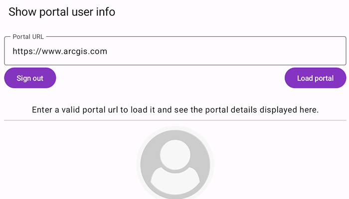

# Show portal user info

Retrieve a user's details via a Portal.

## Use case

This portal information can be used to provide a customized UI experience for the user. For example, you can show a thumbnail of the user in the application to indicate that they are currently logged in. Additionally, apps such as ArcGIS Field Maps use this functionality to integrate with Portal.

## How to use the sample

Enter your ArcGIS Online credentials for the specified URL.

## How it works

1. On startup, the app presents the user with an editable text field containing a portal URL.
2. Upon pressing the "Load" button, a portal will be created and loaded.
3. If the portal is secured, it may potentially issue an authentication challenge.
4. If the portal is successfully loaded, the info screen below will display the portal info, otherwise it will display the loading error.
5. Upon successful login, get a `PortalUser` using `portal.user`. Get user attributes using:
   * `portalUser.portalName`
   * `portalUser.fullName`
   * `portalUser.email`
   * `portalUser.creationDate`
   * `portalUser.thumbnail.image`
6. The "Sign out" button clears any saved credentials.

## Relevant API

* OAuthUserConfiguration
* Portal
* PortalInfo
* PortalUser

## About the data

This sample signs into your ArcGIS online account and displays the user's profile information.

## Additional information

This sample uses the toolkit's [authentication](https://github.com/Esri/arcgis-maps-sdk-kotlin-toolkit/tree/main/toolkit/authentication#authenticator) module to handle authentication. For information about setting up the toolkit, as well as code for the underlying component, visit the [toolkit docs](https://developers.arcgis.com/kotlin/toolkit/).

## Tags

account, avatar, bio, cloud and portal, email, login, picture, profile, user, username
