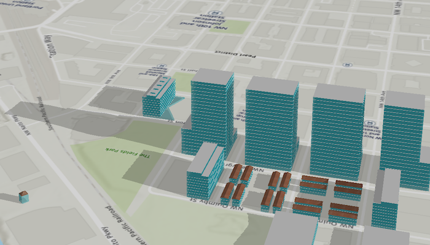

# Show realistic light and shadows

Show realistic lighting and shadows for a given time of day.

## Use case

You can use realistic lighting to evaluate the shadow impact of buildings and utility infrastructure on the surrounding community. This could be useful for civil engineers and urban planners, or for events management assessing the impact of building shadows during an outdoor event.

## How to use the sample

Select one of the three lighting options to show that lighting effect on the `SceneView`. Select a time of day from the slider (based on a 24hr clock) to show the lighting for that time of day in the `SceneView`.

## How it works

1. Create a `Scene` and display it in a `SceneView`.
2. Create a `Calendar` to define the time of day.
3. Set the sun time to the scene view using the `sunDate(_:)` modifier.
4. Set the sun lighting of the scene view to `off`, `light`, or `lightAndShadows` using the `sunLighting(_:)` modifier.

## Relevant API

* Scene
* SceneView
* SceneView.SunLighting

## Additional information

This sample uses the GeoView-Compose Toolkit module to be able to implement a composable SceneView.

## Tags

3D, lighting, realism, realistic, rendering, sceneview-compose, shadows, sun, time, toolkit
