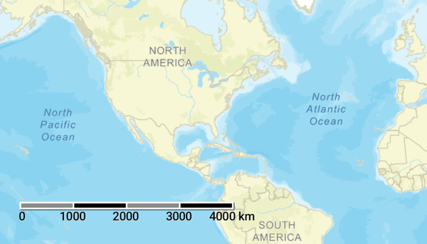

# Show scale bar

Add a scale bar to visually gauge distances on a map.

## Use case

Allows a user to have a visual reference for distances when navigating the map.

## How to use the sample

Zoom in or out of the map. The scale bar will automatically display the appropriate scale based on zoom level. Units can be in metric and/or imperial based on locale/optional settings.

## How it works

1. Create an `ArcGISMap` and add it to a `MapView` composable.
2. Listen and track callback changes from `onUnitsPerDipChanged`, `onViewpointChangedForCenterAndScale`, `onSpatialReferenceChanged` using the composable `MapView`.
3. Add the `Scalebar` composable positioned on top of the `MapView`
4. Pass in the latest values of `unitsPerDip`, `viewpoint`, `spatialReference` & use a preferred `maxWidth` into the `ScaleBar`.

## Relevant API

* ArcGISMap
* MapView
* Scalebar
* UnitSystem

## Additional information

The scale will be accurate for the center of the map, and in general more accurate at larger scales (zoomed in). This means at smaller scales (zoomed out), the reading may be inaccurate at the extremes of the visible extent.

This sample uses the scale bar toolkit component, which requires the [toolkit](https://github.com/Esri/arcgis-maps-sdk-kotlin-toolkit). For information about setting up the toolkit, as well as code for the underlying component, visit the the developer's [documentation page](https://developers.arcgis.com/kotlin/toolkit/).

## Tags

map, measure, scale, toolkit
