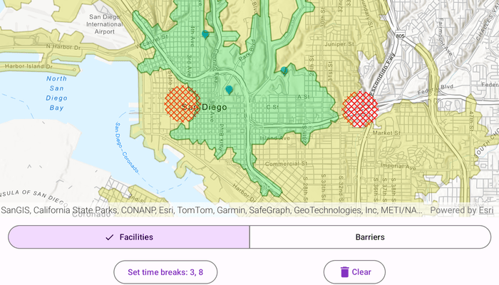

# Show service area

Find the service area within a network from a given point.

## Use case

A service area shows locations that can be reached from a facility based on a certain impedance, such as travel time or distance. Barriers can increase impedance by either adding to the time it takes to pass through the barrier or by altogether preventing passage.

For example, you might calculate the region around a hospital in which ambulances can service in 30 minutes or less.

## How to use the sample

- To add a facility, select the "Facilities" mode and tap anywhere on the map.
- To add a barrier, select the "Barriers" mode and tap on the map to add barrier polygons.
- Use the "Set time breaks" button to adjust the time break values for the service area calculation.
- Tap the "Solve Service Area" button to calculate and display the service area polygons around the facilities, considering any barriers.
- Use the "Clear" button to remove all facilities, barriers, and service area polygons from the map.

## How it works

1. Create a `ServiceAreaTask` from a network analysis service.
2. Create default `ServiceAreaParameters` from the service area task.
3. Set the parameters to return polygons and dissolve overlapping areas.
4. Add one or more `ServiceAreaFacility` instances at the locations of the facility graphics.
5. Add any polygon barriers as `PolygonBarrier` instances.
6. Set the time breaks (impedance cutoffs) for the service area calculation.
7. Solve the service area task using the parameters to get a `ServiceAreaResult`.
8. Get any `ServiceAreaPolygon` results and display them as graphics in a `GraphicsOverlay` on the map.

## Relevant API

- ServiceAreaTask
- ServiceAreaParameters
- ServiceAreaFacility
- PolygonBarrier
- ServiceAreaResult
- ServiceAreaPolygon

## Tags

barriers, facilities, impedance, logistics, network analysis, routing, service area
