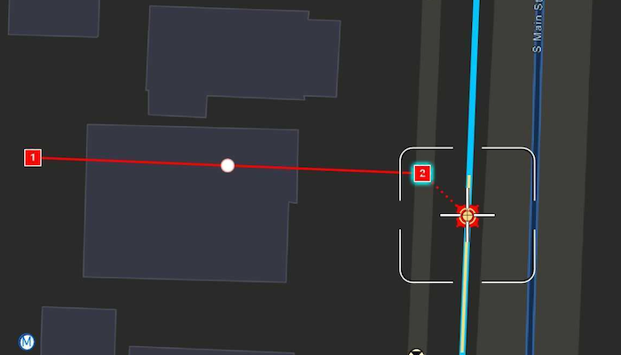

# Snap geometry edits

Use the Geometry Editor to edit a geometry and align it to existing geometries on a map.

## Use case

A field worker can create new features by editing and snapping the vertices of a geometry to existing features on a map. In a water distribution network, service line features can be represented with the polyline geometry type. By snapping the vertices of a proposed service line to existing features in the network, an exact footprint can be identified to show the path of the service line and what features in the network it connects to. The feature layer containing the service lines can then be accurately modified to include the proposed line.

## How to use the sample

To create a geometry, press the create button to choose the geometry type you want to create (i.e. points, multipoints, polyline, or polygon) and interactively tap and drag on the map view to create the geometry.

To configure snapping, press the snap settings button to enable or disable snapping and choose which snap sources to snap to.

To interactively snap a vertex to a feature or graphic, ensure that snapping is enabled for the relevant snap source and move the map position of the reticle to nearby an existing feature or graphic. When the reticle is close to that existing geoelement, the edit position will be adjusted to coincide with (or snap to), edges and vertices of its geometry. Tap to place the vertex at the snapped location.

To edit a geometry, tap the geometry to be edited in the map and then edit the geometry by tapping and moving its vertices and snapping them to nearby features or graphics.

To edit a vertex using the reticle, tap when the reticle is located over the vertex, drag the map to move the position of the reticle, then tap a second time to place the vertex.

To undo changes made to the geometry, press the undo button.

To delete a vertex, tap when the reticle is located over the vertex and then press the delete button.

To save your edits, press the save button.

## How it works

1. Create a `Map` from the `URL` and connect it to the `MapView`.
2. Set the map's `LoadSettings.featureTilingMode` to `enabledWithFullResolutionWhenSupported`.
3. Create a `GeometryEditor` and connect it to the map view.
4. Create a `ReticleVertexTool` and set it into the `GeometryEditor.tool`.
5. Call `syncSourceSettings` after the map's operational layers are loaded and the geometry editor connected to the map view.
6. Set `SnapSettings.isEnabled` and `SnapSourceSettings.isEnabled` to true for the `SnapSource` of interest.
7. Start the geometry editor with a `GeometryType`.

## Relevant API

* FeatureLayer
* Geometry
* GeometryEditor
* GeometryEditorReticle
* GeometryEditorStyle
* GraphicsOverlay
* MapView
* ReticleVertexTool
* SnapSettings
* SnapSource
* SnapSourceSettings

## About the data

The [Naperville water distribution network](https://www.arcgis.com/home/item.html?id=b95fe18073bc4f7788f0375af2bb445e) is based on ArcGIS Solutions for Water Utilities and provides a realistic depiction of a theoretical stormwater network.

## Additional information

Snapping is used to maintain data integrity between different sources of data when editing, so it is important that each `SnapSource` provides full resolution geometries to be valid for snapping. This means that some of the default optimizations used to improve the efficiency of data transfer and display of polygon and polyline layers based on feature services are not appropriate for use with snapping.

To snap to polygon and polyline layers, the recommended approach is to set the `FeatureLayer`'s feature tiling mode to `FeatureTilingMode.enabledWithFullResolutionWhenSupported` and use the default `ServiceFeatureTable` feature request mode `FeatureRequestMode.onInteractionCache`. Local data sources, such as geodatabases, always provide full resolution geometries.

Snapping can be used during interactive edits that move existing vertices using the `VertexTool` or `ReticleVertexTool`. It is also supported for adding new vertices for input devices with a hover event (such as a mouse move without a mouse button press). Using the `ReticleVertexTool` to add and move vertices allows users of touch screen devices to clearly see the visual cues for snapping.

This sample uses the GeoViewCompose Toolkit module to be able to implement a Composable MapView.

## Tags

edit, feature, geometryeditor, geoviewcompose, graphics, layers, magnify, map, reticle, snapping
