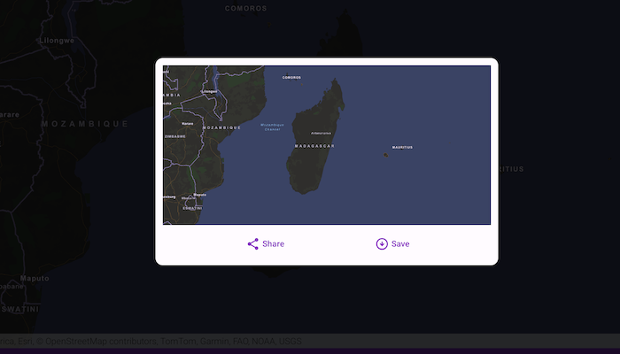

# Take screenshot

Take a screenshot of the map.

## Use case

GIS users may want to export or save a screenshot of a map to enable sharing as an image or printing.

## How to use the sample

Pan and zoom to find an interesting location, then use the button to take a screenshot. The screenshot will be displayed. You can share the screenshot by tapping the share button. Or save it by tapping the save button.

## How it works

1. Wait for the `MapView` to finish drawing.
2. Call `exportImage()` to get a `BitmapDrawable`.
3. Save screenshot into a File using `FileOutputStream`.
4. Share the file using `context.startActivity`.
5. Save the file using `context.contentResolver`.

## Relevant API

* MapView

## Tags

capture, export, image, print, screen capture, screenshot, share, shot
