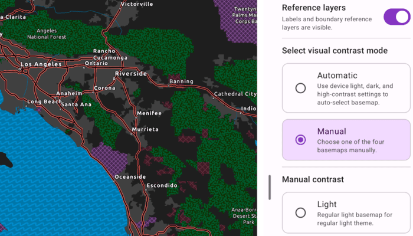

# Update basemap for contrast accessibility

Display a map view that updates between authored light, dark, and high-contrast basemaps.

## Use case

Use this pattern when your app needs contrast-responsive basemaps to switch between light, dark, and high-contrast states. This is especially useful with basemaps authored for accessibility, along with reference layers for the associated base layer.

## How to use the sample

When the sample is launched, it displays the chosen contrast basemap. When automatic mode is selected for the sample, changing the device appearance in the device system settings between light and dark theme, or turn high contrast on and off, will result in the appropriate basemap being loaded to match settings. Toggle the device settings to see the different basemaps.

Switch to manual mode to choose Light, Dark, High contrast light, or High contrast dark directly. Show or hide the basemap's reference layers to compare how labels and boundaries read in each contrast appearance mode.

## How it works

1. Provide four authored basemaps that represent the supported contrast appearances: Light, Dark, High contrast light, and High contrast dark.
2. Resolve which contrast appearance should be active based on the current mode and device settings.
   * In manual mode, use the appearance selected in the supporting pane.
   * In automatic mode, resolve the appearance from the device's current light, dark, and high-contrast settings. This sample uses a custom `rememberDeviceContrastSettings()` Composable.
3. Map the resolved appearance to an ArcGIS Online `Basemap` or a `BasemapStyle` and update the map's `basemap`.
4. Apply the current reference-layer visibility setting to the basemap's labels and boundary layers.

## Relevant API

* Basemap
* BasemapStyle
* Map

## About the data

This sample uses four ArcGIS Living Atlas web maps authored for regular light, regular dark, high-contrast light, and high-contrast dark presentation states.

* [Enhanced Contrast Map](https://www.arcgis.com/home/item.html?id=084291b0ecad4588b8c8853898d72445)
* [Enhanced Contrast Dark Map](https://www.arcgis.com/home/item.html?id=3e23478909194c54992eaaee78b5f754)
* [Dark Gray Canvas](https://www.arcgis.com/home/item.html?id=358ec1e175ea41c3bf5c68f0da11ae2b)
* [Light Gray Canvas](https://www.arcgis.com/home/item.html?id=979c6cc89af9449cbeb5342a439c6a76)

The enhanced contrast web maps are designed for accessibility-focused presentation workflows, and the light and dark canvas maps provide the regular contrast companions. You can use these web maps as a starting reference for your own contrast-specific basemap workflows.

## Additional information

For more background information on the cartographic approach behind the enhanced contrast basemaps, see [Working with Enhanced Contrast basemaps to improve accessibility](https://www.esri.com/arcgis-blog/products/arcgis-living-atlas/mapping/working-with-enhanced-contrast-basemaps-to-improve-accessibility/).

On Android, automatic mode responds to system light and dark theme changes and to high-contrast settings. Android 14 and later uses `UiModeManager`, while earlier versions read the accessibility high-text-contrast setting.

## Tags

accessibility, accessible, basemap, colorblind, contrast, dark, enhanced, high, inclusive, legibility, light, living atlas, readability, vision, visual impairment, WCAG
