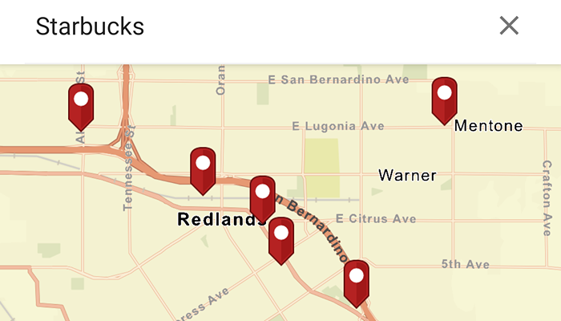

# Search with geocode

Find the location for an address or places of interest near a location or within a specific area.

## Use case

You can input an address into the app's search bar and zoom to the address location. If you do not know the specific address, you can get suggestions and locations for places of interest (POIs) with a natural language query for what the place has ("food"), the type of place ("gym"), or the generic place name ("Coffee"), rather than the specific address. Additionally, you can filter the results to a specific area.

## How to use the sample

Enter an address and optionally choose from the list of suggestions to show its location as a pin graphic. Tap on a result pin to display the address. Toggle the switch to search within the MapView's extent. Use it to query again for the currently viewed area on the map.

## How it works

1. Create a `LocatorTask` using the World GeocodeServer.
2. Create the `GeocodeParameters` and set the `maxResults` and `resultAttributeNames` to return.
3. To get suggestion results use `LocatorTask.suggest(SearchText)`.
4. Perform a locator search `LocatorTask.geocode(SearchText, GeocodeParameters)`.
    * To search in MapView's extent, set`GeocodeParameters.searchArea = mapView.getCurrentViewpoint()`
5. Identify a result pin graphic in the graphics overlay at `GeocodeResult.displayLocation` and add the attributes `GeocodeResult.attributes` to the graphic
6. Use `Graphic.attributes` to retrieve the address attributes of the graphic to display on map. 

## Relevant API

* GeocodeParameters
* GeocodeResult
* LocatorTask
* SearchSuggestion
* SuggestResult

## Additional information

This sample uses the World Geocoding Service. For more information, see [Geocoding service](https://developers.arcgis.com/documentation/mapping-apis-and-services/search/services/geocoding-service/) from ArcGIS Developer website.

## Tags

address, businesses, geocode, locations, locator, places of interest, POI, point of interest, search, suggestions
