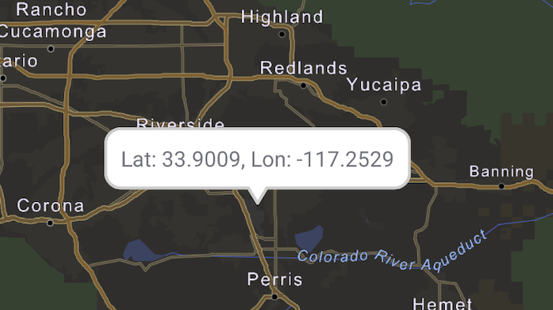

# Show callout

Show a callout with the latitude and longitude of user-tapped points.

## Use case

Callouts are used to display temporary detail content on a map. You can display text and arbitrary UI controls in callouts.

## How to use the sample

Tap anywhere on the map. A callout showing the WGS84 coordinates for the tapped point will appear.

## How it works

1. When the user taps, get the tapped location(map point) from the `SingleTapConfirmedEvent`.
2. Project the point's geometry to WGS84 using `GeometryEngine.projectOrNull(mapPoint, SpatialReference.wgs84())`.
3. Create a new Android TextView object and set its text to the coordinate string from the point.
4. Show the `Callout` on the map view using `mapView.callout.show()` which takes the above created View and WGS84 point as parameters.
5. Center the map on the tapped location using `mapView.setViewpointCenter`.

## Relevant API

* Callout
* GeometryEngine
* MapView
* Point

## Tags

balloon, bubble, callout, flyout, flyover, info window, popup, tap
