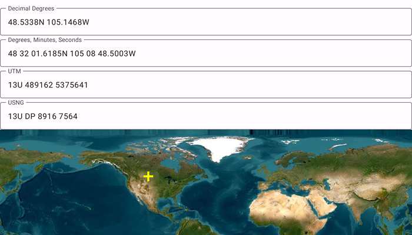

# Show coordinates in multiple formats

Format coordinates in a variety of common notations.

## Use case

The coordinate formatter can format a map location in WGS84 in a number of common coordinate notations. Parsing one of these formats to a location is also supported. Formats include decimal degrees; degrees, minutes, seconds; Universal Transverse Mercator (UTM), and United States National Grid (USNG).

## How to use the sample

Tap on the map to see a marker with the tapped location's coordinate formatted in 4 different ways. You can also put a coordinate string in any of these formats in the text field. Hit Enter and the coordinate string will be parsed to a map location which the marker will move to.

## How it works

1. Get or create a map `Point` with a spatial reference.
2. Use one of the static "to" methods on `CoordinateFormatter` such as `CoordinateFormatter.toLatitudeLongitudeOrNull(point = newLocation, format = LatitudeLongitudeFormat.DecimalDegrees, decimalPlaces = 4)` to get the formatted string.
3. To go from a formatted string to a `Point`, use one of the "from" static methods like `CoordinateFormatter.fromUtmOrNull(coordinates = coordinateNotation, utmConversionMode = UtmConversionMode.LatitudeBandIndicators, spatialReference = null)`.

## Relevant API

* CoordinateFormatter
* CoordinateFormatter.LatitudeLongitudeFormat
* CoordinateFormatter.UtmConversionMode

## Additional information

This sample uses the GeoCompose Toolkit module to be able to implement a Composable MapView.

## Tags

convert, coordinate, decimal degrees, degree minutes seconds, format, geocompose, latitude, longitude, toolkit, USNG, UTM
