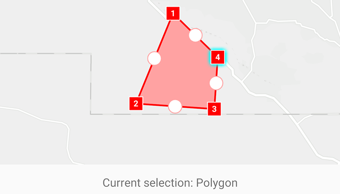

# Sketch on map

Use the Sketch Editor to edit or sketch a new point, line, or polygon geometry on to a map.

## Use case

A field worker could annotate features of interest on a map (via the GUI) such as location of dwellings (marked as points), geological features (polylines), or areas of glaciation (polygons).

## How to use the sample

Choose which geometry type to sketch from one of the available buttons along the bottom of the screen. Choose from points, multipoints, polylines, polygons, freehand polylines, and freehand polygons.

Use the buttons at the top of the screen to: undo or redo change made to the sketch whilst in sketch mode, and to save the sketch to the graphics overlay.

## How it works

1. Create a `GeometryEditor` and pass it to the MapView with `mapView.geometryEditor = geometryEditor`.
2. Set the `GeometryEditor.tool` to `VertexTool()` for vertex geometry or `FreehandTool()` for free hand geometry
3. Use `GeometryEditor.start(GeometryEditorCreationMode)` to start sketching.
4. Check to see if undo and redo are possible during a sketch session using `GeometryEditor.canUndo` and `GeometryEditor.canRedo`. If it's possible, use `GeometryEditor.undo()` and `GeometryEditor.redo()`.
5. Check if sketch is valid using `GeometryBuilder.builder(sketchGeometry).isSketchValid`, then allow the sketch to be saved to a `GraphicsOverlay`.
6. Get the geometry of the sketch using `geometryEditor.geometry.value`, and create a new `Graphic` from that geometry. Add the graphic to the graphics overlay.
7. To exit the sketch editor, use `GeometryEditor.stop()`.

## Relevant API

* Geometry
* GeometryEditor
* GeometryEditorCreationMode
* Graphic
* GraphicsOverlay
* MapView

## Tags

draw, edit, sketch
