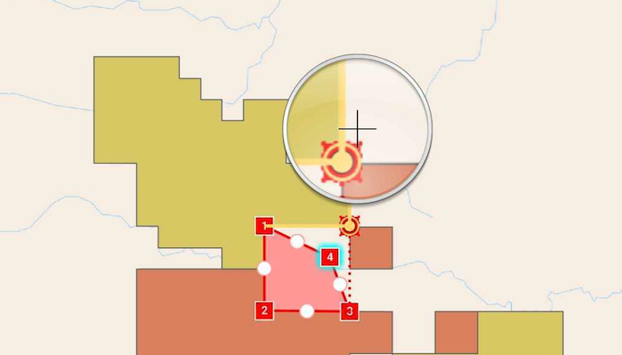

# Snap to features

Use the Geometry Editor to snap and create new features that are exactly aligned with existing features on a layer.

## Use case

A field worker can create new features by snapping to existing full-resolution feature geometries on a map layer. Geometry types such as polygons can be used to represent project boundaries of an oil sands project for which approval has been granted to develop. By editing and snapping the vertices of a proposed boundary to existing boundaries, an exact footprint of where the development will occur can be identified and the boundary layer correctly modified.

## How to use the sample

Use the control panel to create new geometries, undo changes made to the geometry, save the geometry, remove all geometries from the map, and configure snapping.

To create a new geometry, press the create button on the control panel and choose the geometry type you want to create (i.e. point, multipoint, polyline, or polygon) and interactively tap and drag on the map view to create the geometry.

To edit an existing geometry, tap the geometry to be edited in the map to select it and then edit the geometry by tapping and dragging elements of the geometry.

To configure snapping, press the snap settings button on the control panel to manually toggle snapping and choose the snap-to layers.

To snap to an existing feature, create a vertex and drag it until it is nearby a feature of interest. Ensure the layer containing the feature is a valid snap source and that it is enabled in the snap settings.

## How it works

Todo

## Relevant API

* Geometry
* GeometryEditor
* Graphic
* GraphicsOverlay
* MapView
* ArcGISMap
* MapView.interactionOptions.isMagnifierEnabled
* Snapping

## About the data

This sample uses the [OilSandsProjectBoundaries](https://sampleserver6.arcgisonline.com/arcgis/rest/services/OilSandsProjectBoundaries/MapServer) data which includes all active, approved and "other" projects in the oil sands from 1985 to 2015 collected by Alberta Environment and Parks.

## Additional information

This sample uses the GeoCompose Toolkit module to be able to implement a Composable MapView.
It only works on a device with a touch screen. The magnifier will not appear via a mouse click.

## Tags

geocompose, magnify, map, toolkit, zoom, draw, edit, snapping
